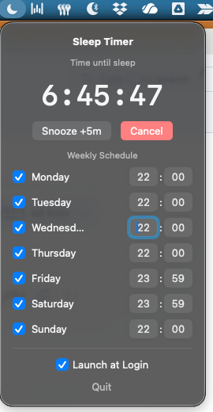

# Sleep Timer

Because apparently we need software to tell us to go to bed.

You know how it goes. "Just one more email." "I'll just finish this article." "Let me check one more thing." Next thing you know, it's 2 AM and you're watching a video about how medieval peasants made cheese.

This app is for those of us who have accepted that willpower is a finite resource, and that sometimes the only way to go to bed is to have your computer forcibly put itself to sleep. It's not giving up—it's *automation*.



## Features

- **Weekly schedule** — Set different sleep times for each day, because your Friday night cheese video binges deserve different treatment than Tuesday
- **Snooze button** — For when you need "just 5 more minutes" (we both know where this leads)
- **1-minute warning** — A notification to save your work and make peace with your browser tabs
- **Launch at login** — Because if you have to manually start this app, you've already lost

## Requirements

- macOS 13.0 or later
- A vague sense that your screen time is out of control

## Installation

```bash
git clone https://github.com/MacL3an/sleep-timer.git
cd sleep-timer
xcodebuild -project SleepTimer.xcodeproj -scheme SleepTimer -configuration Release build SYMROOT=build
cp -r build/Release/SleepTimer.app /Applications/
open /Applications/SleepTimer.app
```

## Usage

Click the moon icon in your menu bar. Set your bedtime for each day. Try not to hit snooze more than three times. We believe in you.

## License

MIT — Do whatever you want with it. Maybe you'll actually get some sleep.
